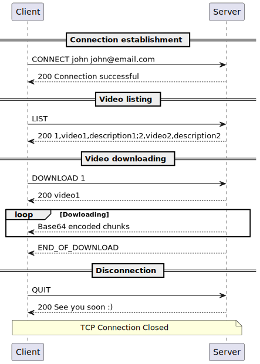
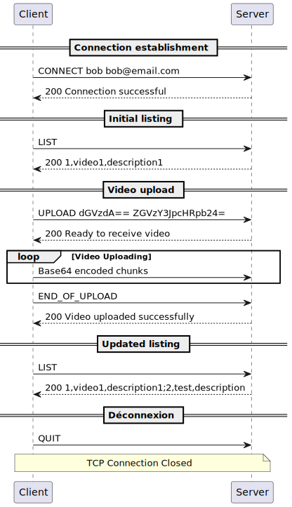
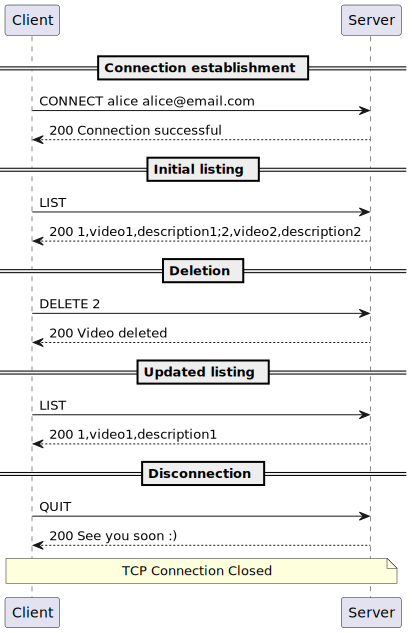
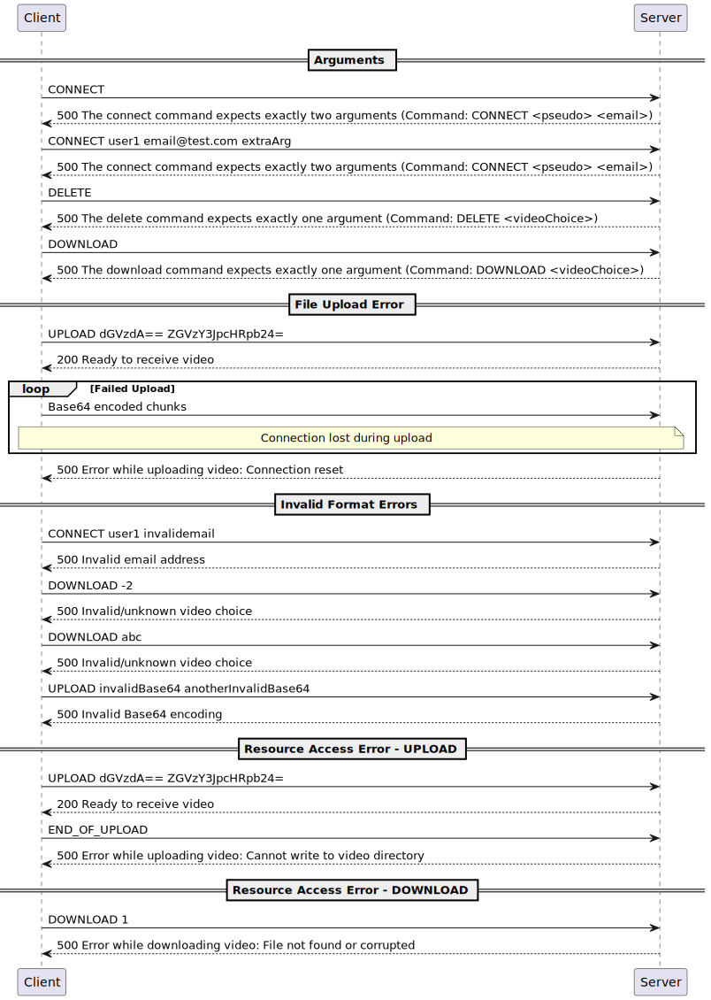
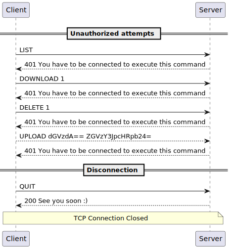
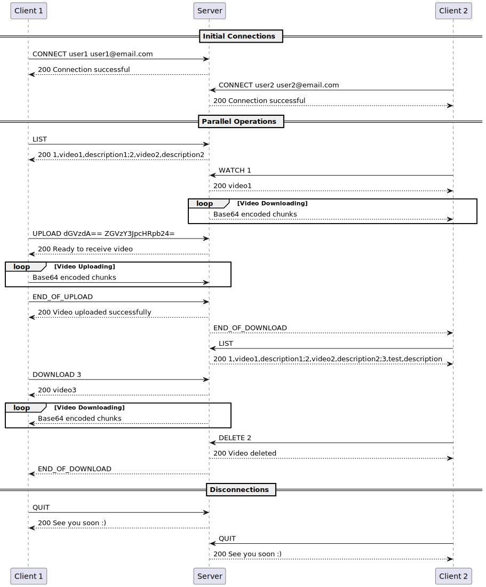
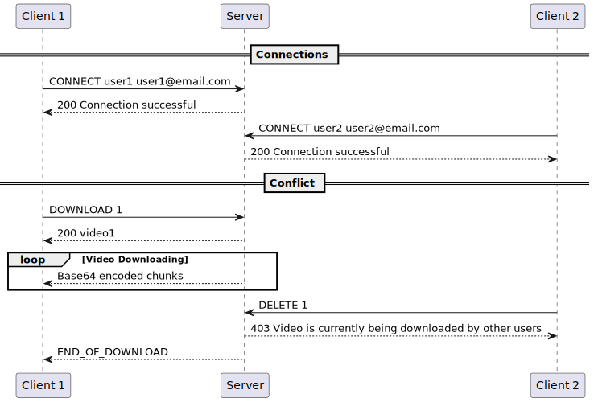

# Video Manager Application Protocol

## 1. Overview
Video Manager Application (VMA) is a protocol for retrieving and uploading video files to a server. Its aim is to 
simplify video sharing between users.

## 2. Transport protocol
VMA is a client-server protocol for listing, uploading, downloading and deleting videos.  
VMA uses the __TCP protocol__ for these exchanges.  
The default port is __1986__.

The exchanges between client and server are as follows:
- Sending a command and its arguments from the client to the server.
- Transfer of data in the form of text encoded in Base64. These exchanges are from client to server during an upload and
  from server to client during a download. The delimiters are ``END_OF_UPLOAD`` and ``END_OF_DOWNLOAD`` respectively.
- Sending a code followed by a message from the server to the client. The code can represent a confirmation or an error.
  The message describes the code.

For all commands, a server-side validity check is performed on the command and its arguments. If the execution of the 
command encounters a problem, the server will send an error to the client. In the event of an error, the client will 
display the message.  

If it manages to connect to the server, the client must connect to the service before it can send any more
messages. It is __the client that initiates the connection__. Using the ``CONNECT`` command allows you to launch an 
interactive authentication managed by the client. The client asks the user for and verifies his username and email 
address. It then builds the command and sends it to the server.  
Alternatively, it is possible to send ``CONNECT <Username> <Email>`` directly, in which case management is carried out 
solely by the server.
The server returns a confirmation.

The user can request the list of videos. The server will then send confirmation code and a list of the videos
that are available.

The user can request to download a video. The server returns a confirmation and starts sending the data. When the client
receives confirmation, it starts receiving the data. The end of the transmission is marked by its delimiter.

The user can ask to upload a video to the server. Using the ``UPLOAD`` command launches an interactive interface for 
setting the upload parameters managed by the client. The client asks the user and checks the title, description and path
of the video. It then builds the command and sends it to the server.  
The server returns a confirmation so that the transfer can begin. At the end of the transfer, the client sends the 
defined delimiter and the server returns a confirmation.

The user can request that a video be deleted. The server checks that the video exists and that it is available for 
deletion. If so, it deletes it. Otherwise it returns an error. It must not be possible to delete a video being uploaded
by another user.

When the client has finished using the service, it uses the ```QUIT``` command to end the connection. The user is then is 
then removed from the list of users and the server returns a confirmation.  

## 3. Messages
Dans tout les cas, le serveur va répondre avec un code et un message.

- ``` <CommandResponseCode> <Message>```

Liste des codes : 
- 200 (OK)
- 500 (ERROR)
- 404 (NOT_FOUND)
- 403 (FORBIDDEN)
- 401 (UNAUTHORIZED).

Pour l'ensemble des commandes, sauf ```CONNECT``` et ```QUIT```, le serveur répondra toujours par le code ```401```
(UNAUTHORIZED) et par le message ```You have to be connected to execute this command``` si le client n'est pas connecté.

### Connexion au serveur

Le client demande au serveur pour se connecter.

#### Message

```CONNECT <pseudo> <email>```

#### Réponse

- Pour le code ```200``` (OK). La connexion est validée.
  ```Connection successfull```

- Pour le code ```500``` (ERROR)

    - Si le pseudo est invalide:
      ```Invalid pseudo```
    - Si l'adresse mail est invalide:
      ```Invalid email address```
    - Si l'utilisateur existe déjà:
      ```User already exists```
    - Si le nombre d'arguments n'est pas valide:
      ```Server error : The connect command expects exactly two arguments (CONNECT <pseudo> <email>)```

### Lister les vidéos

Le client demande au serveur la liste des vidéos.

#### Message

```LIST```

#### Réponse

- Pour le code ```200``` (OK), on reçoit la liste des vidéos disponibles.   
  ```1,<titre_1>,<description_1>;2,<titre_2>,<description_2>;...;n,<titre_n>,<description_n>;```

- Pour le code ```404``` (NOT_FOUND)
    - Pas de vidéos stockées sur le serveur:
      ```No videos found```

### Téléchargement d'une vidéo

Le client demande au serveur pour télécharger une vidéo. Cette commande se passe en deux temps. Premièrement, le serveur confirme que la vidéo est disponible en envoyant un code ```200``` (OK) et le titre de la vidéo. Ensuite, le serveur envoie les données de la vidéo __sous forme de flux envoyé par chunk et encodé en Base64__.

Le flux est considéré comme terminé lorsque le serveur envoie le délimiteur ```END_OF_DOWNLOAD```. Lorsque le client reçoit ce délimiteur, il arrête de lire les données, et le téléchargement est considéré comme terminé.

#### Message

```DOWNLOAD <videoChoice>```

#### Réponse

- Pour le code ```200``` (OK).
    - Confirmation du début du téléchargement: ```<titre_video>```
- Pour le code ```404``` (NOT_FOUND)
    - La video demandée n'existe pas: ```Invalid/unknown video choice```
- Pour le code ```403``` (FORBIDDEN)
    - La vidéo n'est actuellement pas disponible: ```Video is currently being deleted or is unavailable```
- Pour le code ```500``` (ERROR)
    - Si le nombre d'arguments n'est pas valide:
      ```Server error : The download command expects exactly one argument (DOWNLOAD <videoChoice>)```

#### Exception

En cas d'exception lors du transfert, le serveur retournera un code ```500``` (ERROR) suivit du message ```Error while 
downloading video : <Exception_message>```

### Dépôt d'une vidéo

Le client demande au serveur pour déposer une vidéo.

#### Message

```UPLOAD <Base64_titre> <Base64_description>```

#### Réponse

La réponse se fait en trois temps. Le serveur confirme ou non les informations reçue pour lancer le transfert. Après cette confirmation, le serveur se prépare à recevoir les données de la vidéo __sous forme de flux envoyé par chunk et encodé en Base64__.

Le flux est considéré comme terminé lorsque le client envoie le délimiteur ```END_OF_UPLOAD```. Le serveur confirme ensuite si le transfert c'est bien passé, et la vidéo est alors disponible.

- Validation pour débuter le transfert
    - Pour le code ```200``` (OK)
        - Confirmation du début du téléchargement: ```Ready to receive video```
    - Pour le code ```500``` (ERROR)
        - Problème dans l'encodage du titre ou de la descritpion: ```Invalid Base64 encoding```
        - Si le titre existe déjà: ```Video title already exists```
        - Si le nombre d'arguments n'est pas valide:
          ```Server error : The upload command expects title and description```
    - Pour le coce ```401``` (UNAUTHORIZED)
        - L'utilisateur n'est pas connecté: ```You have to be connected to execute this command```

- Confirmation du transfert
    - Pour le code ```200``` (OK)
        - Confirmation du succès du téléchargement: ```Video uploaded successfully```

#### Exception

En cas d'exception lors du transfert, le serveur retournera un code ```500``` (ERROR) suivit du message ```Error while 
uploading video : <Exception_message>```

### Suppression d'une vidéo

Le client demande au serveur de supprimer une vidéo.

#### Message

```DELETE <videoChoice>```

#### Réponse

- Pour le code ```200``` (OK).
    - Confirmation de la suppression: ```Video deleted```
- Pour le code ```404``` (NOT_FOUND)
    - La video demandée n'existe pas: ```Video not found```
- Pour le code ```403``` (FORBIDDEN)
    - La vidéo n'est actuellement pas disponible: ```Video is currently being downloaded by other users```
- Pour le code ```500``` (ERROR)
    - Si le nombre d'arguments n'est pas valide:
      ```Server error : The delete command expects exactly one argument (DELETE <videoChoice>)```

#### Exception

En cas d'exception lors de la suppression, le serveur retournera un code ```500``` (ERROR) suivit du message ```Server 
error : <Exception_message>```  

### Déconnexion du serveur

Le client se décocnnecte du serveur.

#### Message

```QUIT```

#### Réponse

- Pour le code ```200``` (OK).
    - Confirmation de la déconnexion: ```See you soon :)```

_Le serveur renverra toujours une confirmation de déconnexion, même si l'utilisateur n'était pas connecté._


## Examples

### Default operations

#### Downloading


#### Uploading


#### Deleting


### Error handling

#### Several errors



#### Unauthenticated commands



### Concurrency Example

#### Without any concurrent error



#### With concurrent error

